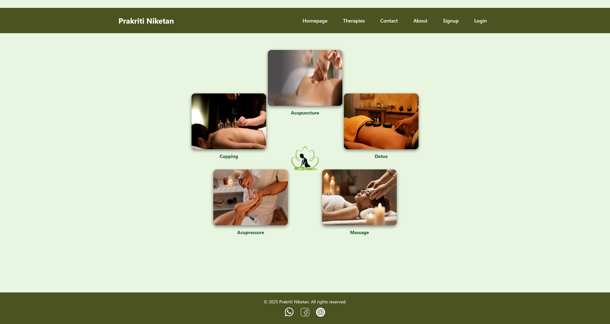
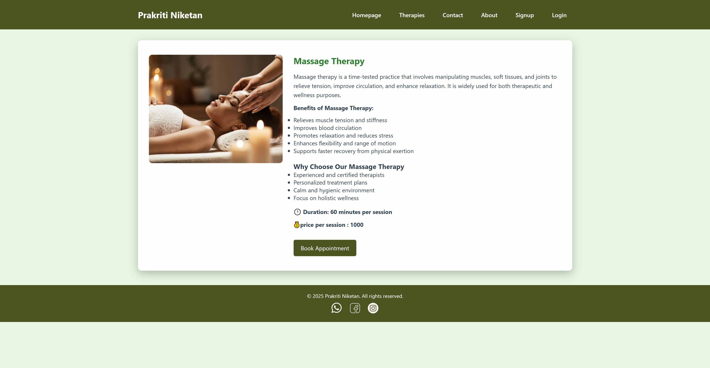
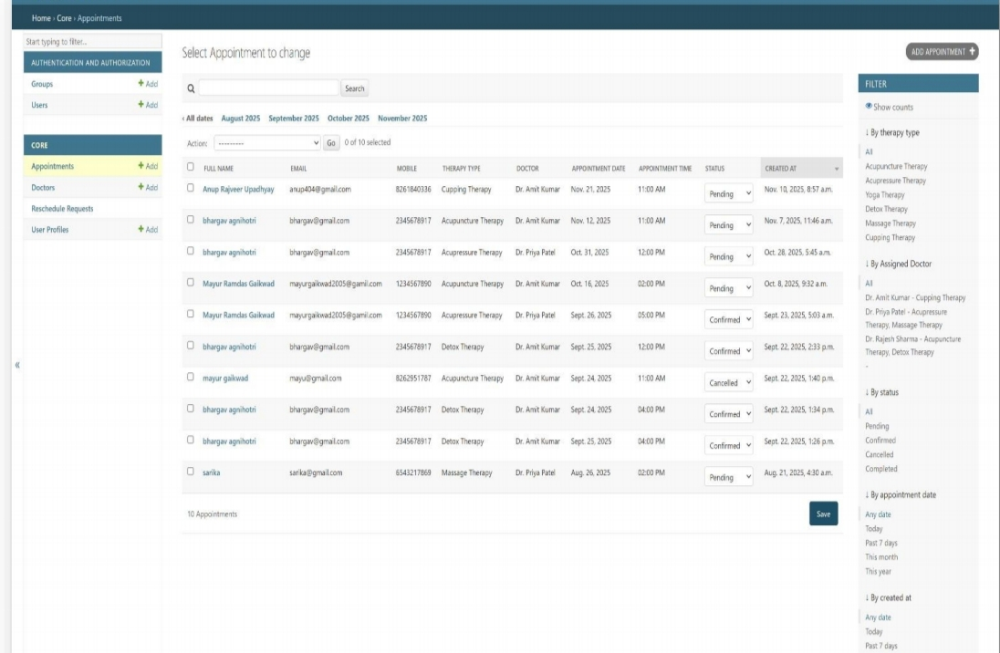

# 🌿 Massage Therapy Center Website

A full-stack healthcare website developed using Django, HTML, CSS and JavaScript for holistic wellness services, therapy information and appointment booking.

## 📌 Features

- Homepage with interactive navigation  
- Therapy pages including Acupuncture, Acupressure, Detox, Cupping and Massage  
- User signup and login authentication  
- Appointment booking system  
- My Appointments dashboard  
- Contact page  
- About Us page  
- Responsive frontend design  
- Django routing and template integration  
- Static images and social media links
---
## 💻 Technologies Used

- Python  
- Django  
- HTML  
- CSS  
- JavaScript
---
## 🚀 How to Run

1. Activate virtual environment : venv\Scripts\activate
2. Run server : python manage.py runserver
3. Open in browser : http://127.0.0.1:8000/
---
## 🔗 Repository Link

https://github.com/chetnagaikwad/Massage_therapy_center
---
## 📷 Project Screenshots
  
  
  
  

